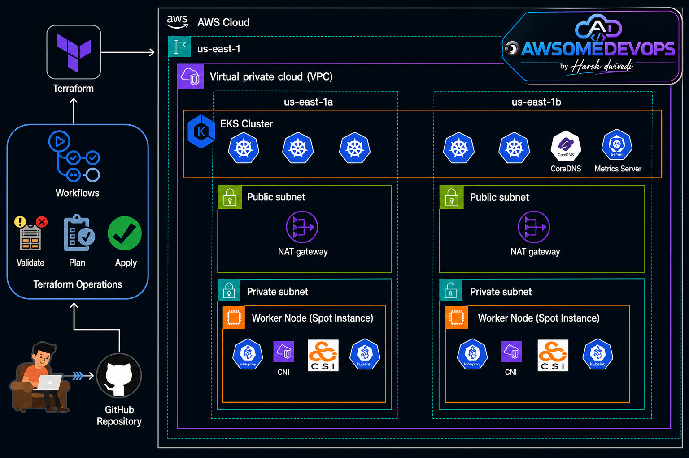

# 🚀 AWSOMEDEVOPS by Harsh Dwivedi
## Production-Ready Amazon EKS Cluster using Terraform

<p align="center">
  
</p>

---

# 📌 Overview

This project demonstrates how to provision a highly available and cost-optimized Amazon EKS cluster using Terraform. The architecture follows AWS best practices by deploying worker nodes in private subnets across multiple Availability Zones while keeping the EKS control plane managed by AWS.

The entire infrastructure is deployed using Infrastructure as Code (IaC) through Terraform and stored in GitHub for version control and collaboration.

---

# 🏗️ Architecture Diagram


```text
Developer
    │
    ▼
GitHub Repository
    │
    ▼
Terraform Workflow
├── terraform validate
├── terraform plan
└── terraform apply
    │
    ▼
AWS Cloud
    │
    ▼
VPC
├── AZ-1a
│   ├── Public Subnet
│   │   └── NAT Gateway
│   │
│   └── Private Subnet
│       └── Worker Nodes
│           ├── Kubernetes Pods
│           ├── AWS CNI
│           └── EBS CSI Driver
│
└── AZ-1b
    ├── Public Subnet
    │   └── NAT Gateway
    │
    └── Private Subnet
        └── Worker Nodes
            ├── Kubernetes Pods
            ├── AWS CNI
            └── EBS CSI Driver
```

---

# 🎯 Architecture Goals

- High Availability
- Cost Optimization using Spot Instances
- Secure Networking
- Infrastructure as Code
- Multi-AZ Deployment
- Production Ready Design
- Scalability and Reliability

---

# 🔹 Components Used

| Component | Purpose |
|------------|----------|
| Terraform | Infrastructure provisioning |
| GitHub | Source code repository |
| Amazon EKS | Managed Kubernetes |
| VPC | Network isolation |
| Public Subnets | Host NAT Gateways |
| Private Subnets | Host Worker Nodes |
| NAT Gateway | Internet access for private nodes |
| Spot Instances | Cost reduction |
| AWS CNI | Pod networking |
| EBS CSI Driver | Persistent storage |
| CoreDNS | Internal DNS |
| Metrics Server | Resource metrics |

---

# 📖 Step 1: Developer Pushes Code

The DevOps Engineer writes Terraform code locally and pushes it to GitHub.

```bash
git add .
git commit -m "Provision EKS"
git push origin main
```

GitHub acts as the single source of truth for infrastructure code.

---

# 📖 Step 2: Validate Terraform Code

Terraform validates the syntax and configuration.

```bash
terraform validate
```

Purpose:

- Detect syntax issues
- Verify configuration structure
- Ensure resources are correctly referenced

---

# 📖 Step 3: Generate Execution Plan

Terraform generates an execution plan.

```bash
terraform plan
```

Purpose:

- Preview changes
- Review resources before creation
- Prevent accidental modifications

---

# 📖 Step 4: Deploy Infrastructure

Apply the Terraform configuration.

```bash
terraform apply
```

Terraform creates:

- VPC
- Subnets
- NAT Gateways
- EKS Cluster
- Node Groups
- IAM Roles
- Security Groups

---

# 📖 Step 5: VPC Creation

Terraform provisions a custom VPC.

```text
CIDR: 10.0.0.0/16
```

Benefits:

- Network isolation
- Controlled traffic flow
- Security segmentation

---

# 📖 Step 6: Create Public Subnets

Two public subnets are created.

```text
AZ-1a Public Subnet
AZ-1b Public Subnet
```

Purpose:

- Host NAT Gateways
- Allow outbound internet access

---

# 📖 Step 7: Create NAT Gateways

One NAT Gateway is deployed in each public subnet.

Benefits:

- Worker nodes remain private
- Pods can access internet
- Security patches can be downloaded

Traffic Flow:

```text
Private Node
     │
     ▼
NAT Gateway
     │
     ▼
Internet
```

---

# 📖 Step 8: Create Private Subnets

Private subnets are created in both Availability Zones.

Purpose:

- Host worker nodes securely
- Prevent direct internet exposure

---

# 📖 Step 9: Deploy EKS Control Plane

Terraform provisions the EKS control plane.

AWS manages:

- API Server
- Scheduler
- Controller Manager
- etcd

Benefits:

- No control plane maintenance
- Automatic scaling
- High availability

---

# 📖 Step 10: Deploy Worker Nodes

Managed node groups are deployed.

Configuration:

```text
Node Type: Spot Instances
Location: Private Subnets
```

Benefits:

- Lower cost
- Auto scaling
- Multi-AZ availability

---

# 📖 Step 11: Install AWS CNI

AWS VPC CNI enables networking.

Responsibilities:

- Assign IP addresses
- Pod-to-Pod communication
- Pod-to-Service communication

---

# 📖 Step 12: Install EBS CSI Driver

Provides persistent storage for applications.

Example:

```yaml
kind: PersistentVolumeClaim
```

Use Cases:

- Databases
- Stateful Applications
- Logging Systems

---

# 📖 Step 13: Deploy CoreDNS

CoreDNS handles service discovery.

Example:

```text
frontend.default.svc.cluster.local
```

Purpose:

- Internal DNS
- Service communication

---

# 📖 Step 14: Deploy Metrics Server

Metrics Server collects resource metrics.

Metrics:

- CPU Usage
- Memory Usage

Required for:

- HPA (Horizontal Pod Autoscaler)

---

# 🔐 Security Best Practices

### Worker Nodes in Private Subnets

Nodes are never exposed directly to the internet.

### IAM Roles

Least privilege access.

### Security Groups

Restrict inbound and outbound traffic.

### Multi-AZ Deployment

Protection against AZ failures.

---

# 💰 Cost Optimization

### Spot Instances

Benefits:

- Up to 90% cheaper
- Suitable for stateless workloads

### Managed EKS

No control plane maintenance.

### Auto Scaling

Scale based on workload demand.

---

# 📈 High Availability Design

```text
Region: us-east-1

AZ-1a
 ├── NAT Gateway
 └── Worker Nodes

AZ-1b
 ├── NAT Gateway
 └── Worker Nodes
```

Benefits:

- Fault tolerance
- Zero single point of failure
- Increased uptime

---

# 🚀 Deployment Commands

Initialize Terraform

```bash
terraform init
```

Validate Configuration

```bash
terraform validate
```

Generate Plan

```bash
terraform plan
```

Deploy Infrastructure

```bash
terraform apply
```

Destroy Infrastructure

```bash
terraform destroy
```

---

# 📊 Architecture Summary

| Feature | Status |
|----------|----------|
| Multi-AZ | ✅ |
| Private Worker Nodes | ✅ |
| Spot Instances | ✅ |
| AWS Managed Control Plane | ✅ |
| Terraform IaC | ✅ |
| GitHub Integration | ✅ |
| Production Ready | ✅ |

---

# 👨‍💻 Author

## AWSOMEDEVOPS
### By Harsh Dwivedi

Cloud | DevOps | Kubernetes | Terraform | AWS